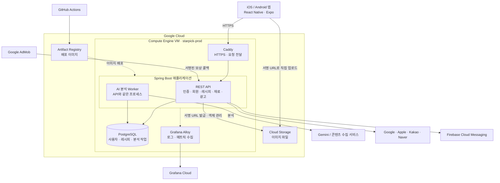

# 별따먹자 출시 발표 구성안

대상: 팀 전체 서비스 발표, 10~15분. 기본 구성은 약 12분이며 질의응답은 별도다.
확인 기준: 2026-10-01, 백엔드 로컬 커밋 `686f25a`, 저장소의 배포 구성 및 기술 명세.
프론트 스택은 확인한 package.json 기준으로 기술명만 표기한다. 출시 빌드의 정확한 버전은 프론트 담당자가 최종 확인한다.

이 문서는 슬라이드에 옮길 문구와 발표 대본 초안이다. PPT 파일은 아니다.
기술 선택 이유 중 문서에 결정 배경이 없는 항목은 현재 구조를 설명하는 제안이며, 당시 팀의 선택 이유와 맞춰 최종 확정한다.

## 전체 흐름

| 순서 | 슬라이드 | 시간 | 담당 제안 |
|---|---|---|---|
| 1 | 서비스 소개와 해결할 문제 | 1분 | PM |
| 2 | 핵심 사용자 경험 | 1분 | PM/디자인 |
| 3 | 실제 앱 시연 | 2분 30초 | 프론트 |
| 4 | 기술 스택과 선택 이유 | 1분 | 개발 |
| 5 | 서비스 아키텍처 | 1분 20초 | 백엔드 |
| 6 | 핵심 데이터 설계 | 1분 | 백엔드 |
| 7 | AI 분석 처리 흐름 | 1분 | 해당 구현 담당자 |
| 8 | 트러블슈팅: 탈퇴와 소셜 연결 | 1분 10초 | 백엔드 |
| 9 | 배포와 검증 | 1분 | 인프라/백엔드 |
| 10 | 출시 결과와 다음 개선 | 1분 | PM/팀 |

기술 스택부터 데이터 설계까지 약 3분 20초이며, AI 흐름과 트러블슈팅을 포함하면 약 5분 30초다.
10분 발표에서는 사용자 경험 소개를 시연에 합치고, AI 처리 흐름을 아키텍처 설명에 포함한다.
15분 발표에서는 부록의 게스트 전환 또는 광고 보상 중 한 가지를 추가한다.

## 1. 서비스 소개와 해결할 문제

### 슬라이드 문구

**별따먹자 — 나의 레시피가 별이 된다**

- 사진과 영상 링크에서 레시피 초안을 만들고 나만의 레시피로 저장
- 보유 재료를 관리하고 저장한 레시피 중 메뉴 추천
- 요리 기록과 별을 활용한 사용자 경험

### 설명 초안

“별따먹자는 발견한 요리 콘텐츠를 실제로 다시 꺼내 쓰는 레시피로 정리하는 앱입니다. 사진이나 링크의 내용을 레시피 초안으로 바꾸고, 사용자가 확인하고 수정해 저장할 수 있습니다. 저장 이후에는 재료 관리와 메뉴 추천으로 이어집니다.”

출시일, 플랫폼별 스토어 링크, 사용자 조사·인터뷰 결과는 PM이 보유한 실제 자료로 추가한다. 조사하지 않은 수치나 사용자 불편을 검증 결과처럼 쓰지 않는다.

## 2. 핵심 사용자 경험

### 슬라이드 문구

`레시피 발견 → 사진·링크 분석 → 초안 확인·수정 → 저장 → 재료 기반 추천·요리 기록`

- AI 결과를 바로 확정하지 않고 사용자가 수정할 수 있는 초안으로 제공
- 저장된 레시피를 홈의 별과 연결
- 가입 없이 시작하는 진입 흐름

### 설명 초안

“분석한 결과를 그대로 저장하는 대신 사용자가 재료나 조리 순서를 확인할 수 있도록 했습니다. 레시피를 쌓는 과정은 홈의 별과 연결하고, 이후에는 보유 재료를 바탕으로 저장한 레시피를 다시 활용하도록 구성했습니다.”

게스트의 실제 기능 범위는 출시 빌드로 확인한다. 백엔드의 게스트 계정 지원만으로 프론트의 모든 기능 제한이 제거되었다고 설명하지 않는다.

## 3. 실제 앱 시연

### 시연 순서

1. 앱 진입 및 홈 확인
2. 사진 또는 지원 링크로 분석 요청
3. 분석 초안의 재료와 조리 순서를 확인하고 수정
4. 레시피 저장 후 홈/목록 반영
5. 보유 재료 등록 및 메뉴 추천

네트워크나 외부 콘텐츠 제공자의 응답에 영향을 받으므로 동일 시나리오의 녹화 영상도 준비한다.
광고 지급은 실제 운영 연동 검증이 끝난 뒤 시연에 넣는다. 현재 확인한 운영 콜백 접근과 광고 ID 설정만으로 보상 지급까지 완료됐다고 판단하지 않는다.

## 4. 기술 스택과 선택 이유

### 슬라이드 문구

| 영역 | 기술 | 선택 이유를 설명하는 문장 |
|---|---|---|
| 앱 | React Native · Expo · TypeScript | iOS와 Android의 화면과 로직을 공유하고 빌드·배포 작업을 관리 |
| 백엔드 | Java 25 · Spring Boot 4.1.1 | 인증과 데이터 처리를 한 애플리케이션에서 구현하고 트랜잭션으로 정합성 관리 |
| 데이터 | PostgreSQL 18 · Spring Data JPA · Flyway | 관계와 제약 조건을 DB로 보장하고 스키마 변경을 코드로 관리 |
| 인프라 | GCP Compute Engine · Docker Compose · Caddy | 앱·DB·HTTPS 구성을 한 VM에서 운영하고 컨테이너 단위로 배포 |
| 이미지·AI | GCS · Gemini | 파일 저장·전송과 레시피 분석을 역할에 맞는 외부 서비스로 분리 |
| 검증·운영 | Testcontainers · GitHub Actions · Grafana Alloy/Cloud | 실제 PostgreSQL 테스트, 배포 자동화, 로그·메트릭 관측 |

### 설명 초안

“앱은 React Native와 Expo로 두 플랫폼을 함께 개발했습니다. 백엔드는 Spring Boot와 PostgreSQL을 사용해 사용자, 레시피, 광고 보상 간의 관계를 트랜잭션으로 관리합니다. 이미지와 AI 분석은 각각 GCS와 Gemini에 맡겼고, API 서버와 데이터베이스는 GCP VM에서 Docker Compose로 운영합니다.”

### 선택 근거와 비용

- Spring/JPA: 도메인별 서비스와 영속성 코드를 구성하기에 적합하다. 복잡한 잠금·배치 작업에는 JDBC와 직접 쿼리도 사용한다. ‘성능이 가장 좋아서’라는 비교 주장은 하지 않는다.
- PostgreSQL: FK·UNIQUE·CHECK 제약, 행 잠금, 분석 결과 JSONB, 작업 선점을 한 DB에서 사용한다.
- 단일 앱·VM: 배포할 요소와 통신 경계를 줄이는 선택으로 설명할 수 있다. 한 VM 장애가 API와 DB에 함께 영향을 주며, 독립 확장과 고가용성에는 한계가 있다. 비용 우위는 실제 청구서 비교 없이 수치화하지 않는다.
- GCS 직접 업로드: 이미지 바이너리를 API 서버가 중계하지 않도록 설계한 이유가 업로드 명세에 명시돼 있다. 대신 소유자·용도·객체 연결 여부를 서버가 관리해야 한다.
- PostgreSQL 작업 테이블: 별도 메시지 브로커 없이 AI 분석 요청의 상태를 보존한다. 폴링 지연과 API/작업자 자원 공유를 감수한다는 결정이 분석 명세에 명시돼 있다.
- Java 25와 Boot 버전: 적용 버전은 확인했으나 그 버전이 필수였던 이유까지 코드로 증명되지는 않는다. 단순히 최신 버전이라서 빨라졌다고 설명하지 않는다.

## 5. 서비스 아키텍처

### 슬라이드용 구성도



### 설명 초안

“사용자 요청은 HTTPS로 Caddy를 거쳐 Spring Boot에 전달됩니다. PostgreSQL은 VM 내부에서 사용하며 외부에 DB 포트를 공개하지 않습니다. 사진은 서버가 발급한 임시 URL을 통해 앱에서 GCS로 직접 올립니다. AI 작업자는 API와 같은 프로세스 안에서 DB의 분석 작업을 가져가 Gemini를 호출합니다.”

그림의 경계: DB는 Cloud SQL이 아니라 VM 내부 PostgreSQL 컨테이너다. Worker는 별도 서버가 아니다. GCS와 Artifact Registry는 VM 안의 컨테이너가 아니다. Gemini·FCM은 외부 관리형 서비스다. 화살표는 주요 논리 흐름이며 모든 네트워크 홉을 나타내지는 않는다.

운영 VM에서의 실제 Alloy 실행 상태나 대시보드 화면을 제시할 때는 현재 운영 화면을 사용한다. 저장소 설정 존재와 실행 상태는 구분한다.

## 6. 핵심 데이터 설계

### 슬라이드 문구

| 데이터 영역 | 핵심 테이블 | 설계 포인트 |
|---|---|---|
| 사용자·인증 | users, profiles, social_credentials, refresh_tokens | 사용자와 소셜 식별자 분리, 게스트/회원 구분 |
| 레시피·재료 | recipe, recipe_ingredient, recipe_step, ingredient, user_ingredient | 레시피의 재료·단계를 분리하고 순서 관리 |
| 분석 | ingestion_job | 진행 상태와 초안을 저장하고 확정 레시피와 분리 |
| 광고 | ad_reward_session, ad_reward_transaction, ad_reward_daily_quota | 시청 세션·거래·일일 한도를 분리하고 중복 보상 방지 |

### 설명 초안

“사용자와 소셜 로그인 식별자를 분리해 로그인 제공자에 관계없이 내부 사용자 ID로 데이터를 관리합니다. 레시피의 재료와 조리 단계는 별도 테이블에 저장합니다. AI 분석 결과는 아직 사용자가 확정하지 않은 초안이므로 분석 작업 테이블에 보관하고, 저장을 선택한 시점에 정식 레시피로 만듭니다.”

### 관계 요약 — 본문에는 일부만 표시

```text
users ── profiles                  사용자별 프로필
      ├─ social_credentials       제공자별 로그인 식별자
      ├─ refresh_tokens           사용자별 갱신 토큰 해시
      ├─ recipe ── recipe_ingredient / recipe_step / cook_history
      ├─ user_ingredient ── ingredient
      ├─ user_custom_ingredient
      ├─ ingestion_job            분석 상태, JSONB 초안
      └─ ad_reward_session / ad_reward_daily_quota

ad_reward_session ── ad_reward_transaction
```

- `(provider, social_uid)` UNIQUE: 같은 소셜 계정의 중복 가입 방지. 이메일로 서로 다른 소셜 계정을 임의 병합하지 않는다.
- `(user_id, ingredient_id)` UNIQUE: 같은 공통 재료의 중복 보유 행 방지.
- `account_type` CHECK: 게스트는 가입 완료 시각이 없고, 회원은 가입 완료 시각이 있어야 한다.
- 광고 `transaction_id` UNIQUE와 지급 세션 부분 UNIQUE 인덱스: 같은 거래 또는 세션의 중복 지급 방어.
- 이미지 바이너리는 GCS, 소유자·용도·objectKey 등 관리 정보는 DB에 저장한다.
- 전체 ERD를 본문에 빽빽하게 넣지 않고 핵심 관계만 설명한다.

## 7. AI 분석 처리 흐름

### 슬라이드 문구

`분석 요청 → 202 + 작업 ID → DB에 작업 저장 → Worker 분석 → 앱이 상태 조회 → 초안 확인 → 레시피 저장`

- 외부 분석 응답을 기다리는 HTTP 요청과 실제 분석 작업을 분리
- DB에 작업 상태를 남겨 작업 추적과 복구에 활용
- 작업 선점 시 이미 잠긴 작업을 건너뛰어 동시 처리

### 설명 초안

“AI 분석은 시간이 걸리기 때문에 요청을 받은 연결에서 끝날 때까지 기다리지 않습니다. 작업을 저장하고 작업 ID를 먼저 반환합니다. 앱은 상태를 조회하고, 서버 내부 작업자가 분석한 결과를 DB에 기록합니다. 사용자가 결과를 확인한 뒤 저장하면 레시피가 됩니다.”

기본 설정은 2초 폴링, 동시 처리 수 2다. 이는 처리 성능 측정값이 아니라 설정값이다.
`SKIP LOCKED`는 작업 선점 경쟁을 줄이는 장치이며 전체 외부 분석의 exactly-once 실행을 의미하지 않는다.
재배포 중 분석이 끊기면 stale 복구 기준에 따라 지연될 수 있다. 낮은 지연이나 대규모 병렬 처리 목표가 생기면 작업자 분리·메시지 브로커 도입을 검토한다.

## 8. 트러블슈팅: 탈퇴 후에도 남아 있던 네이버 연결

### 슬라이드 문구

| 단계 | 내용 |
|---|---|
| 문제 | 탈퇴 후 재가입해도 네이버 정보 제공 동의 화면을 다시 거치지 않음 |
| 원인 | 서비스 내부 회원 삭제와 네이버의 앱 연결 해제는 별개 |
| 수정 | 네이버 인증 정보를 받아 외부 연결 해제를 먼저 요청하고, 성공 후 로컬 탈퇴 진행 |
| 검증 | 인증 정보 누락·외부 해제 실패 시 로컬 계정 유지, 성공 시 기존 정리 흐름 진행 |

### 설명 초안

“처음에는 우리 서비스의 회원 데이터를 지우면 소셜 로그인도 초기화될 것으로 생각하기 쉽습니다. 하지만 네이버의 앱 연결 정보는 외부 시스템에 별도로 남습니다. 그래서 네이버 연결 해제를 로컬 삭제 앞에 추가했고, 해제 요청이 실패하면 계정을 먼저 지우지 않도록 처리했습니다.”

### 기술 질문 대비

- 네이버 외부 호출과 로컬 DB 삭제는 하나의 DB 트랜잭션으로 묶을 수 없다.
- 외부 해제 성공 후 로컬 실패가 발생할 수 있다는 경계가 남는다. 모든 외부/내부 작업이 원자적이라고 설명하지 않는다.
- 로컬 탈퇴가 접수된 뒤의 DB 정리는 `deleted_at` 상태와 복구 스케줄러로 이어간다.
- 네이버 UI가 어떤 화면을 보여주는지는 외부 서비스 정책에도 영향을 받으므로 “항상 최초 가입과 완전히 같은 화면”을 기술적 보장으로 쓰지 않는다.

근거: 커밋 `d1e62e8`, NaverTokenRevocationClient, UserWithdrawalService, UserWithdrawalApiTest.

## 9. 배포와 검증

### 슬라이드 문구

`PR/커밋 → CI 빌드·테스트 → SHA 태그 이미지 → Artifact Registry → 운영 배포 승인 → 백업·배포·상태 확인`

- 개발 환경 자동 배포와 운영 환경 수동 승인 배포 구분
- 실제 PostgreSQL 기반 통합 테스트
- 배포 전 백업, 실패 시 이전 앱 이미지로 복귀 시도
- 로그·메트릭 및 외부 상태 점검

### 설명 초안

“코드 병합과 운영 반영을 구분했습니다. CI에서 빌드와 테스트를 확인하고, 커밋 SHA로 식별되는 이미지를 저장합니다. 운영은 승인 후 배포하며, 배포 전 DB 백업과 애플리케이션 상태 확인을 수행합니다. 문제가 생기면 이전 앱 이미지로 되돌리는 절차를 갖췄습니다.”

전체 테스트 900개 통과는 2026-09-29, 게스트 전환 구현 당시 `./gradlew build` 결과다. 현재 출시 버전의 테스트 수나 커버리지로 바꾸어 표현하지 않는다.
실패 시 롤백은 앱 이미지와 코드 기준이다. DB 스키마 변경까지 자동 복원하지 않는다.
현재 dev VM의 실제 가동 여부와 무관하게 저장소에는 dev 자동 배포 경로가 남아 있다. 운영 배포가 main 병합만으로 자동 실행된다고 설명하지 않는다.

## 10. 출시 결과와 다음 개선

### 슬라이드 문구

- 출시 화면과 다운로드 QR: PM이 확정한 스토어 주소 사용
- 사용자 피드백에 따른 추천·가입 흐름 개선
- 이미지 정리의 재시도 보강
- 사용량과 응답 지연에 따라 작업자·DB 분리 검토

### 설명 초안

“출시 이후에는 실제 사용 과정에서 발견되는 문제를 우선 개선하고 있습니다. 다음 단계는 이미지 삭제처럼 외부 시스템까지 이어지는 작업의 복구를 보강하고, 이용량과 응답 지연을 측정하면서 필요한 부분부터 확장하는 것입니다.”

다운로드 수, 활성 사용자 수, 전환율, AI 분석 성공률, 평균 비용은 실제 수집값이 있을 때만 넣는다.

## 부록 A. 게스트 신규 가입과 정리의 원자성

상태: 로컬 커밋 `686f25a`에서 구현·테스트 확인. 이 조사에서 운영 반영 여부를 확인하지 않았으므로 출시 완료 기능으로 단정하지 않는다.

```text
게스트 인증 및 잠금
  → 새 회원 생성
  → 기존 게스트의 정리 대상 표시 + 갱신 토큰 폐기
  → 한 DB 트랜잭션으로 커밋

이후: DB 상태를 읽는 스케줄러가 기존 게스트 기록 정리
```

- 신규 가입은 게스트 기록을 옮기지 않고 새 계정으로 시작한다.
- 가입 실패 시 게스트 상태도 롤백한다.
- 동일 게스트의 동시 가입은 행 잠금과 상태 재검사로 제어한다.
- 커밋 직후 프로세스가 종료돼도 정리 대상 표시가 DB에 남는다.
- 정리 실패가 새 회원 생성 성공을 취소하지 않는다.
- GCS 파일 삭제는 기존 best-effort 처리이며, 영구 재시도 큐/outbox는 별도 개선이다.

예상 질문: “AFTER_COMMIT 이벤트가 유실되면?”
답변: “이벤트에만 의존하지 않습니다. 정리 대상 상태를 가입과 같은 DB 트랜잭션에 저장하고, 스케줄러가 이 상태를 조회합니다.”

## 부록 B. 광고 보상의 중복 지급 방지

상태: 서버 코드·테스트와 운영 콜백 접근, 환경변수 확인 이력이 있다. 실제 앱 광고 시청부터 지급까지의 운영 E2E 검증 완료 여부는 별도 확인한다.

```text
앱이 시청 세션 생성
  → 서버가 광고 단위와 customData(세션 ID) 반환
  → 앱이 광고 SDK에 세션 정보를 전달하고 광고 표시
  → Google SSV 콜백
  → 서명·광고 단위·보상·세션 검증
  → 트랜잭션 내 지급 기록과 슬롯 반영
  → 앱이 GRANTED 조회
```

앱의 시청 완료 콜백만으로 서버 슬롯을 늘리지 않는다.
네트워크 재전송과 중복 콜백은 DB의 거래 식별자 및 세션 제약으로 처리한다.
앱 ID는 SDK 앱 식별, 광고 단위 ID는 광고 로드·검증에 사용한다.

## 부록 C. 배포 트러블슈팅 후보

### 오래된 이미지와 healthcheck 실패

- 경험: 수동 재생성 시 `.env.vm`의 과거 APP_IMAGE가 적용되어 이전 이미지가 실행된 사례가 있었다.
- 로그: 컨테이너 안에 curl이 없어 healthcheck 실행 자체가 실패했다.
- 조사: 실제 실행 이미지, healthcheck 로그, 외부 응답을 각각 확인했다.
- 개선: 런타임 이미지에 curl 포함, 충분한 시작 유예 시간, 배포 이미지 식별과 검증 절차.
- 주의: 당시 연결 reset 현상까지 모두 curl 누락 때문이었다고 묶지 않는다. healthcheck 도구 실패와 실제 앱 응답 문제는 별도 증상이다.

### 배포 성공 후 태그 갱신 단계 실패

- 배포 후 `prod-current` 태그 이동 단계에서 삭제 권한 부족으로 워크플로가 실패했다.
- 기존 태그 이동 명령의 동작에 필요한 권한과 서비스 계정 권한이 맞지 않았다.
- `tags update/create` 방식으로 변경한 커밋 `970f470`이 있다.
- 애플리케이션 배포 실패와 후처리 단계 실패를 구분하는 사례로 활용한다.

## 근거 파일

| 설명 | 근거 |
|---|---|
| 백엔드 스택 | `build.gradle` |
| 프론트 스택 | 프론트 저장소 `package.json` |
| VM 컨테이너 구성 | `docker-compose.vm.yml`, `Dockerfile`, `deploy/Caddyfile` |
| CI·배포 | `.github/workflows/ci.yml`, `cd-dev.yml`, `cd-prod.yml`, `deploy.yml`, `.github/scripts/deploy-remote.sh` |
| 관측·백업 | `deploy/alloy/config.alloy`, `deploy/grafana/dashboards/`, `deploy/backup.sh` |
| 스키마 | `src/main/resources/db/migration/V1__init.sql` 및 후속 마이그레이션 |
| 이미지 직접 업로드 | `docs/specs/upload.md`, `domain/upload/service/UploadService.java` |
| AI 작업 | `docs/specs/ingestion.md`, `domain/ingestion/worker/IngestionWorker.java`, `domain/ingestion/repository/IngestionJobRepository.java` |
| 소셜 탈퇴 | `domain/auth/client/naver/NaverTokenRevocationClient.java`, `domain/user/service/UserWithdrawalService.java` |
| 게스트 전환 | `docs/specs/guest-signup.md`, `domain/auth/service/AuthService.java`, `GuestSignupApiTest.java` |
| 광고 검증 | `domain/ad/service/AdRewardCallbackService.java`, `V25__create_ad_reward.sql` |

표의 `domain/` 경로는 `src/main/java/com/star_pick/starpick/domain/` 아래다.
역할 소개에서는 팀이 함께 만든 구조와 발표자가 직접 구현한 기능을 구분한다.
