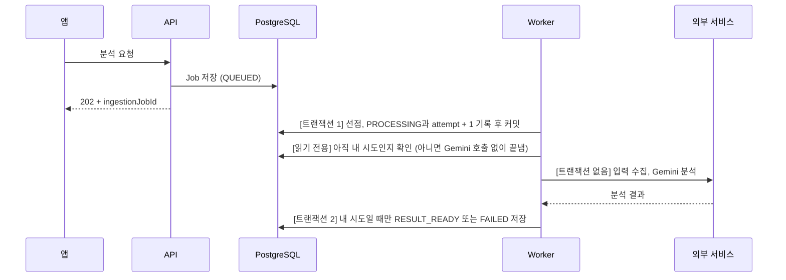
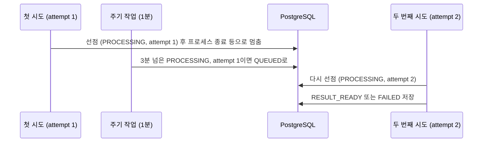

# PostgreSQL 작업 테이블로 AI 레시피 분석 비동기 처리하기

## 요약

- **문제**: AI 레시피 분석이 최대 20여 초 걸리고 실패할 수 있어, 하나의 **요청 안에서 처리하면 결과와 요청을 잃을 수 있음**
- **해결**: Job 상태를 결국 DB에 둬야 하므로 **DB 작업 테이블**로 별도 큐 없이 구현하고, **잠금, 주기 복구, attempt**로 중복과 멈춤을 방지
- **결과**: 요청은 바로 응답하고 분석은 **Worker가 비동기로 처리**하며, 멈춤, 늦은 시도, 재전송에도 **Job마다 결과와 레시피가 하나씩만 남음**

## 1. 문제 배경: 느리고 실패할 수 있는 AI 분석

별따먹자는 사용자가 사진을 올리거나 YouTube, Instagram 링크를 붙여 넣으면 Gemini로 분석해 레시피 초안을 만든다. 앱은 이 초안을
"레시피 직접 입력" 폼에 채우고, 사용자가 값을 고친 뒤 저장한다.

문제는 분석 시간이다. 로컬과 dev에서 실제 Gemini로 기능을 검증하며 잰 처리 시간은 사진 4장 6.5초, YouTube 3-11초,
Instagram 게시물 14-22초, 릴스 18-23초였다. 여기에 Gemini의 일시적인 오류나 Instagram 수집 실패처럼 외부 호출이 실패할 수도 있다.

이 분석을 하나의 요청 안에서 처리하면 다음과 같은 문제가 발생할 수 있다.

```text
분석 요청 ──► 요청 스레드
                │ 분석 (수 초~20여 초)
                ▼
   요청 스레드가 분석 내내 묶임 ❌
   앱 연결이 끊기면 결과를 받을 곳이 없음 ❌
   일시 오류를 재시도하면 그만큼 응답이 늦어짐 ❌
   배포나 재시작 때 진행 중이던 분석이 사라짐 ❌
```

요구사항은 다음과 같았다.

- **즉시 응답**: 분석 요청에는 바로 응답한다.
- **결과 보존**: 앱 연결이 끊겨도 결과를 다시 받을 수 있다.
- **재시도**: 외부 호출의 일시적 오류는 재시도한다.
- **복구**: 서버가 재시작돼도 접수한 요청이 조용히 사라지지 않고, 다시 처리하거나 실패로 알린다.
- **중복 저장 방지**: 앱이 저장 요청을 다시 보내도 같은 분석 결과로 레시피는 하나만 생긴다.

즉, 분석 요청과 분석 처리를 나누고, 그 사이의 분석 작업(이하 Job)을 안전하게 관리할 곳이 필요했다.

## 2. 기술 선택: 왜 별도 큐가 아니라 작업 테이블인가

Job을 관리할 곳은 위 요구사항을 채우는지 먼저 보고, 채우는 방식 사이에서는 두 가지 기준으로 골랐다.

첫째, Job 상태를 DB에 둬야 하는가.

둘째, 처리 시작 지연과 큐 처리량이 문제가 될 만한 작업인가.

다음과 같은 선택지를 고려했다.


| 방식                                                         | 장점                                         | 단점                                                        |
| ---------------------------------------------------------- | ------------------------------------------ | --------------------------------------------------------- |
| 메모리 안에서 바로 비동기 실행(`@Async` 등) → 부족                         | 처리 시작 지연이 없고 단순함                           | 대기 중인 작업까지 메모리에만 있어 재배포나 장애 때 사라진다. **복구**를 채우지 못한다       |
| 요청 커밋 직후 Worker 깨우기 + 느린 주기 확인 → 과잉                        | 처리 시작 지연이 거의 없음                            | 실행 슬롯 관리 코드가 늘고, 오류 경로에서 슬롯이 새면 Worker가 멈춤                |
| 메시지 브로커, 관리형 큐(Redis, Kafka, RabbitMQ, Cloud Tasks 등) → 과잉 | 새 작업을 바로 전달받음. 관리형 큐는 재시도와 동시성 제어를 맡길 수 있음 | 인프라 추가. **결과 보존**과 **중복 저장 방지**를 위해 DB에도 써야 해 outbox가 필요  |
| **작업 테이블 2초 주기 확인 + `SKIP LOCKED` → 채택**                   | 가장 단순. 작업이 DB에 남아 재시작에도 사라지지 않음            | 빈 실행 슬롯이 있어도 대기 Job을 최대 2초 늦게 발견하고, 큐가 비어도 2초마다 조회 쿼리가 나감 |


### 작업 테이블을 선택한 이유

첫 번째 판단 기준은 Job 상태를 어디에 둬야 하는지였다. 결과를 다시 조회하고 같은 결과로 레시피가 두 번 생기지 않게 하려면 Job 상태는
어차피 DB에 있어야 한다. 메모리에서 바로 실행하더라도 재시작 뒤 남은 Job을 찾으려면 결국 DB를 다시 읽어야 하고, 큐를 따로 두면 DB와 큐
두 곳에 써야 한다.

두 번째 판단 기준은 처리 시작 지연과 큐 처리량이 문제가 될 만한 작업인지였다. 분석이 수 초에서 20여 초 걸려 2초 지연은 체감이 작고,
한계는 DB 큐의 처리량보다 Gemini 호출 한도와 비용에서 먼저 온다고 판단했다. 그래서 즉시 깨우기나 브로커의 즉시 전달이 주는 이득이 작다.

결론적으로 Worker가 2초마다 대기 중인 Job을 `FOR UPDATE SKIP LOCKED`로 가져가는 작업 테이블 방식을 선택했다.

## 3. 아키텍처

### 정상 흐름: 분석 성공과 실패



- 앱은 202를 받은 뒤 1-2초마다 상태를 조회하고, `RESULT_READY`, `FAILED`, `EXPIRED` 중 하나를 받으면 멈춘다.
- Gemini 분석과 Instagram 수집의 일시적 오류는 최초 호출을 포함해 최대 3회, 120초 안에서 시도한다.
- 레시피가 아니거나, 원본이 없거나, 재시도를 소진하거나, 시간을 넘기면 `FAILED`와 실패 코드를 저장한다.

### 핵심 설계 결정


| 결정                                          | 이유                                                                                                     |
| ------------------------------------------- | ------------------------------------------------------------------------------------------------------ |
| **선점은 짧은 트랜잭션에서 하고 바로 커밋**                  | `PROCESSING`이 커밋돼야 다른 Worker와 주기 작업이 이 Job을 처리 중으로 본다                                                  |
| **외부 호출은 트랜잭션 밖에서**                         | 수 초에서 수십 초 걸리는 호출이 커넥션과 잠금을 붙잡지 않게 한다                                                                  |
| **커밋 뒤의 소유권은 `PROCESSING`과 `attempt`가 지킨다** | 잠금은 커밋과 함께 풀린다. 긴 처리 동안 누구의 시도인지는 상태값이 판단한다. attempt는 Job이 선점될 때마다 1씩 느는 시도 번호다                        |
| **재시도는 Job을 다시 넣지 않고 한 시도 안에서**             | Job을 다시 넣으면 attempt가 늘어 일시 오류 한 번만으로도 멈춘 작업 복구 기회를 써 버린다. 그래서 재시도는 Job 상태를 바꾸지 않고 120초 deadline 안에서 한다 |


## 4. 구현: 작업 테이블을 큐로 쓸 때 막아야 할 4가지 상황

분석 요청과 처리를 비동기로 나누면서 요청 스레드가 분석 내내 묶이거나, 앱 연결이 끊기면 결과를 잃거나, 재시도만큼 요청 응답이 늦어지거나, 대기 중인 요청이 재시작에 사라지는 문제는
해결됐다. 대신 작업 테이블을 큐로 쓰면서 새로 막아야 할 상황이 네 가지 생긴다.

- 4.1 **중복 선점**: 여러 Worker가 같은 Job을 동시에 가져간다.
- 4.2 **멈춘 Job**: 처리 중에 Worker가 죽으면 Job이 `PROCESSING`으로 남는다.
- 4.3 **늦게 끝난 이전 시도**: 복구로 Job을 다시 넣은 뒤, 느렸을 뿐인 첫 시도가 늦게 돌아와 두 번째 시도 대신 Job을 끝낸다.
- 4.4 **중복 저장**: 앱이 같은 분석 결과로 저장 요청을 두 번 보낸다.

### 4.1 중복 선점: FOR UPDATE SKIP LOCKED

중복 선점은 두 Worker가 같은 Job을 동시에 가져가는 상황이다. 선점 쿼리에 잠금이 없다면 다음과 같이 된다.

```text
Worker A: QUEUED 조회 → Job 100
Worker B: QUEUED 조회 → Job 100
Worker A, B: 둘 다 PROCESSING, attempt 1 → 둘 다 분석
→ 같은 Job으로 Gemini를 두 번 부르고, attempt가 같아 먼저 끝난 쪽의 결과(실패일 수도 있다)로 Job이 끝난다
```

지금은 앱 서버가 한 대라 선점 쿼리에 잠금이 없어도 생기지 않지만, 서버를 늘리면 발생할 수 있는 문제로 선점 쿼리에 행 잠금과 `SKIP LOCKED`를
걸어 미리 막아 두었다.

```java
@Lock(LockModeType.PESSIMISTIC_WRITE)
// SKIP LOCKED
@QueryHints(@QueryHint(name = "jakarta.persistence.lock.timeout", value = "-2"))
@Query("select j from IngestionJob j where j.status = QUEUED order by j.id")
List<IngestionJob> findQueuedForUpdateSkipLocked(Pageable pageable);
```

`PESSIMISTIC_WRITE`가 조회한 행을 잠그고, 잠금 대기 시간 `-2`가 `SKIP LOCKED`를 붙여 다른 Worker가 잠근 행은 기다리지 않고
건너뛴다.

```text
Worker A: Job 100 잠금 → PROCESSING, attempt 1 기록 → 커밋
Worker B: Job 100은 잠겨 있어 건너뜀 → Job 101 선점
(A 커밋 뒤) Worker C: Job 100은 이미 PROCESSING → 조건에서 빠짐, Job 101도 잠겼거나 PROCESSING → Job 102 선점
```

선점하는 순간에는 행 잠금이, 커밋 뒤에는 `PROCESSING` 상태가 같은 Job을 다시 가져가지 못하게 한다. 결과적으로 `SKIP LOCKED`는
같은 Job을 두 번 가져가는 것을 막을 뿐 아니라, 여러 Worker가 서로 기다리지 않고 각자 다른 Job을 가져가게 한다.

### 4.2 멈춘 Job: stale 복구와 대기 상한

Worker가 처리 도중 죽으면 선점은 이미 커밋됐기 때문에 Job이 `PROCESSING`으로 남는다. 프로세스가 갑자기 죽는 경우(강제 종료, 메모리 부족 등)가
그렇고, 재배포 때도 중단 시점에 따라 남을 수 있다. 이렇게 오래 멈춘(stale) Job은 누구도 다시 가져가지 않아, 앱은 결과도 실패도 받지 못한 채 계속 조회한다.

```text
Worker: Job 100 선점 (PROCESSING, attempt 1)
Worker: 프로세스가 갑자기 종료됨
→ Job 100은 PROCESSING으로 남고, 앱은 끝없이 조회한다
```

따라서 1분마다 도는 주기 작업을 통해 3분 넘게 끝나지 않은 첫 시도 작업을 다시 대기열로 돌린다.

```java
update IngestionJob j set j.status = QUEUED
 where j.status = PROCESSING and j.attempt = 1 and j.startedAt < :threshold   // threshold = 지금 - 3분
```



두 번째 시도마저 3분을 넘기면 같은 주기 작업이 다시 큐로 돌리지 않고 `FAILED`로 끝낸다.

3분은 죽었다고 추정하는 기준이다. Job에는 120초 deadline이 있어 정상 Worker는 보통 그 안에 끝나고, 여기에 1분쯤 여유 시간을 더했다.

대기열에서 요청 후 10분 넘게 선점되지 못한 Job은 1분마다 도는 다른 주기 작업이 실패로 처리한다.

결과적으로 멈춘 첫 시도는 한 번만 큐로 돌아가고, 두 번째 시도마저 3분을 넘기면 실패로 끝나, Worker가 떠 있는 한 어떤 Job이든 성공이나 실패로 처리된다.

### 4.3 늦게 끝난 이전 시도: 시도 번호(attempt) 확인

첫 시도가 죽지 않고 단순히 느렸다면, 복구로 되살린 두 번째 시도와 같은 Job을 함께 처리하게 된다. 이때 첫 시도가 뒤늦게 저장하면 두 번째 시도 대신 Job을 끝내 버린다.

attempt를 확인하지 않으면 다음과 같은 문제가 발생한다.

```text
1. 첫 시도 (attempt 1): 선점 → 드물게 3분 넘게 걸림
2. 주기 작업: 3분 넘은 PROCESSING → QUEUED
3. 두 번째 시도 (attempt 2): 다시 선점 → DB의 attempt가 2가 됨 → 분석 중
4. 첫 시도: 뒤늦게 저장 → Job이 아직 PROCESSING이라 상태만 보면 저장된다
→ Job이 이전 시도의 결과로 끝나고, 진행 중인 두 번째 시도의 결과는 버려진다
```

```java
@Transactional
public boolean saveResult(Long jobId, int attempt, RecipeDraft draft, String sourceThumbnailKey) {
    if (!lockActiveOwner(jobId)) return false;                   // 탈퇴 처리와 겹치지 않게 users 행 잠금
    var job = repository.findByIdForUpdate(jobId).orElse(null);  // Job 행 잠금
    if (job == null || !job.isCurrentAttempt(attempt)) {         // PROCESSING이고 attempt가 선점 때와 같은가
        return false;                                            // 늦게 끝난 결과는 버린다
    }
    job.completeWithResult(draft, ...);
    return true;
}
```

저장할 때 선점 때 받은 attempt와 DB의 값을 비교하면 다음과 같이 해결할 수 있다.

```text
4. 첫 시도: 뒤늦게 저장 → 들고 있는 attempt 1과 DB의 2가 달라 거절, 결과를 버림
5. 두 번째 시도: 저장 → 들고 있는 attempt 2와 DB의 2가 같아 저장
→ Job이 지금 유효한 두 번째 시도의 결과로 끝난다
```

비교는 Job 행을 잠근 뒤에 해서, 비교와 저장 사이에 주기 작업이 끼어들지 못하게 한다.

결과적으로 attempt 확인은 첫 시도가 아무리 늦게 돌아와도, 지금 유효한 시도 하나만 결과를 저장하게 한다.

### 4.4 중복 저장: 행 잠금, 소비 기록, UNIQUE

앞의 세 상황은 Worker가 Job을 처리하는 단계에서 생겼다. 이번에는 사용자가 분석 결과를 레시피로 저장하는 단계이다. 응답을 받지 못한
앱이 저장 요청을 다시 보내면, 같은 분석 결과로 저장 요청이 두 번 온다. 같은 요청을 여러 번 보내도
결과가 같아야 한다. 즉 저장이 멱등해야 한다.

아무것도 막지 않으면 다음과 같은 문제가 발생한다.

```text
1. 요청 ①: Job 100의 결과로 레시피 #500 생성 → 응답이 앱에 닿기 전 연결이 끊김
2. 요청 ②: 앱이 같은 요청을 다시 보냄 → 레시피 #501이 하나 더 생긴다
```

```java
@Transactional
public RecipeCreateResult create(Long userId, RecipeCreateRequest request) {
    Long jobId = request.ingestionJobId();
    lifecycle.lockActive(userId);                                      // users 행 잠금
    var origin = consumeService.lockOwnedJob(userId, jobId);           // Job 행 잠금
    Optional<Long> existing = recipeRepository.findIdByIngestionJobId(jobId);
    if (existing.isPresent()) {
        return new RecipeCreateResult(existing.get(), false);          // 200: 이미 만든 레시피를 돌려준다
    }
    // 소비 기록. 이미 소비됨, 만료, 상태 불일치면 409
    consumeService.consume(userId, jobId);
    ...                                                                // 레시피 저장 → 201
}
```

저장을 한 트랜잭션 안에서 이 순서로 처리하면 다음과 같이 해결할 수 있다.

```text
1. 요청 ①: 잠금 → 이 Job으로 만든 레시피 없음 → 소비 기록 → 레시피 #500 저장
2. 요청 ②: 잠금(동시에 왔다면 ①이 끝날 때까지 기다림) → 이 Job으로 만든 레시피 #500 있음 → #500을 그대로 돌려줌
```

소비 기록(`consumedAt`)은 레시피를 지운 뒤 같은 Job으로 다시 만드는 것을 409로 막고, `recipe.ingestion_job_id` UNIQUE는 잠금을 놓친
경우의 마지막 방어선이다.

결과적으로 별도 Idempotency-Key 없이 `ingestionJobId`가 멱등 키 역할을 해, 같은 분석 결과로 저장 요청이 몇 번 와도 레시피는 하나만 생기고 다시 보낸 요청은 오류
대신 같은 레시피를 받는다.

## 5. 한계와 확장 가능성

지금은 VM 한 대에 API, Worker, PostgreSQL을 함께 두는 구조로 충분하다고 판단했다. 요청이 늘면 아래 순서로 한계가 드러날 것으로 보고,
측정으로 병목이 확인될 때만 한 단계씩 넘어갈 예정이다.


| #   | 한계                                       | 확장 방법                                                     |
| --- | ---------------------------------------- | --------------------------------------------------------- |
| 1   | 자원 공유: 분석이 API와 메모리, 커넥션을 나눠 쓴다          | API와 Worker를 다른 서버로 나누고, PostgreSQL도 VM 밖으로 분리 (코드 변경 없음) |
| 2   | 처리 용량: 동시 처리 2건은 보수적인 초기값이라 몰리면 대기가 길어진다 | Worker의 동시 처리 수를 올리고, 부족하면 Worker를 여러 대로 확장 (코드 변경 없음)    |
| 3   | DB Polling: 2초 Polling의 DB 부하를 아직 재지 않았다 | 관리형 큐로 옮기고 outbox를 둔다 (코드 변경 있음)                          |


## 6. 마무리

이번 설계를 통해 깨달은 것은 **같은 기술도 작업의 성격에 따라 답이 달라진다**는 점이다. 이전 개인 프로젝트 FlowMate에서는 DB  
Polling을 실시간성과 DB 부하를 이유로 기각했지만, 이번에는 DB Polling 방식을 선택했다.

FlowMate의 타이머처럼 **다른 기기에 바로 반영돼야 하고, 메시지를 잃어도 원본이 남는 작업**에는 Pub/Sub 같은 전파 방식이 적합했다.
몇 초라도 다른 기기에 이전 상태가 보이면 안 됐고, 원본 상태가 MySQL에 있어 전파 메시지를 잃어도 데이터는 남았다.

반면 이번 분석처럼 **몇 초 정도는 늦어도 괜찮지만 요청 자체를 잃으면 안 되는 작업**에는 DB 작업 테이블 방식이 적합했다. 분석은
20여 초까지 걸려 2초 늦게 알아도 체감이 작고, 접수한 요청이 곧 원본이라 잃으면 안 된다.

결국 좋은 설계는 정답처럼 여겨지는 기술을 고르는 데서가 아니라, 지금 상황과 문제의 본질을 정확히 파악하고 그에 맞는 구조를 고르는
데서 나온다는 것을 느꼈다.