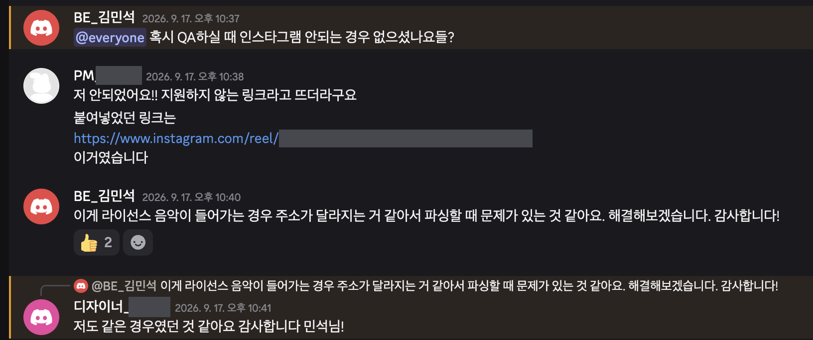
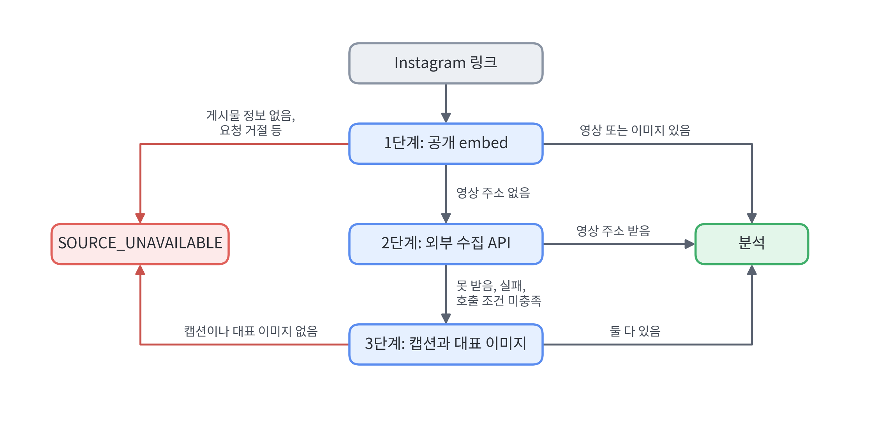

# Instagram 음원 릴스 분석 실패를 3단계 수집 경로로 해결하기

> 관련 문서: [PostgreSQL 작업 테이블로 AI 레시피 분석 비동기 처리하기](ingestion-async-queue.md)

## 요약

- **[문제]** QA에서 다른 입력은 성공했지만 **Instagram 음원(배경음악) 릴스 6개는 모두 실패**
- **[해결]** 성공한 릴스와 응답을 비교해 **음원 릴스만 영상 주소가 없음**을 찾고, 공개 embed → 외부 수집 API → 캡션과 대표 이미지 순서의 **3단계 수집 경로**를 둠
- **[결과]** **실패하던 음원 릴스 6개가 모두 성공**(로컬, dev, prod)

## 1. 문제 배경

별따먹자는 Instagram 링크를 받으면 공개 embed에서 영상이나 이미지를 받아 Gemini로 레시피를 분석한다. 분석은 Worker가 비동기로 처리한다. ([PostgreSQL 작업 테이블로 AI 레시피 분석 비동기 처리하기](ingestion-async-queue.md))

QA(09-16, 09-17)가 끝난 뒤 dev의 분석 결과를 입력 종류별로 집계했다.

| 입력        | 결과                        | 건수  |
| --------- | ------------------------- | ---: |
| 사진        | 성공                        | 9   |
| YouTube   | 성공                        | 3   |
| Instagram | 성공                        | 2   |
| Instagram | 실패 (`SOURCE_UNAVAILABLE`) | 13  |

사진과 YouTube는 모두 성공했지만 Instagram은 15건 중 13건이 실패했다. 13건은 같은 링크 반복이 섞여 있어 서로 다른 릴스로는 6개였고,
모두 배경음악을 쓴 릴스였다.

팀 채널에 QA 중 Instagram 분석이 안 된 경우가 있었는지 묻자 PM과 디자이너가 릴스 링크가 안 됐다고 답했다. 그땐 '라이선스 음악이 들어가면 주소가 달라져 파싱에 문제가 있다'고 추측했다. 2절에서 보듯 음악이 원인이라는 점은 맞았지만, 주소 형식이 달라진 것이 아니라 embed 응답에 영상 주소가 아예 없었다.



## 2. 원인

### 증상

실패한 링크를 로컬에서 다시 돌리자 로그에는 `reason=분석할 카드가 없다` 한 줄만 남았다.

embed를 직접 받아 보니 응답은 200이고 게시물 정보와 캡션도 있었다. 없는 것은 **영상 주소(`video_url`) 하나**였다. Worker는 영상 주소가
없는 릴스를 분석할 수 없어 설계대로 실패시킨 것이다. 문제는 embed가 왜 영상 주소를 주지 않느냐였다.

### 확인: 성공한 릴스와 실패한 릴스 비교

성공하는 원본 오디오 릴스 3개(1절에서 성공한 릴스 포함)와 실패한 음원 릴스 6개의 embed를 비교해 둘을 가르는 필드를 찾았다.

영상 주소 말고 둘을 가른 필드는 `uses_original_audio` 하나였다. 원본 오디오 릴스에는 영상 주소가 있었고, 등록된 음원을 배경음악으로 쓴
릴스에는 없었다. 같은 요청을 반복하거나 embed 주소 4종으로 바꿔 요청해도 결과는 같았다. 브라우저로 연 음원 릴스 embed에도 `<video>`가 없었고, 재생 버튼 자리는 'Instagram에서 보기' 링크였다.

| 릴스                   | `uses_original_audio` | 영상 주소(`video_url`) |
| -------------------- | --------------------- | ------------------ |
| 원본 오디오 릴스 3개 (성공)   | `true`                | 3개 모두 있음           |
| 등록된 음원 릴스 6개 (실패)   | `false`               | 6개 모두 없음           |

결과적으로 영상 주소는 요청 방식이 아니라 게시물의 속성, 곧 음원 사용 여부에 따라 갈렸다.

### 왜 지금까지 몰랐나

Instagram 기능을 만들 때 사전 실측한 릴스는 원본 오디오 릴스 하나였고, 음원 릴스는 표본에 없었다.

또 embed에 영상 주소가 없는 경우를 따로 다루지 않고, 삭제되거나 비공개인 게시물과 같은 `SOURCE_UNAVAILABLE`(원본을 가져올 수 없음)로 묶었다. 로그의 `분석할 카드가 없다`도 카드 번호 초과나 이미지 주소 누락에 함께 쓰던 문구라, 영상 주소가 없다는 사실도, 같은 원인이 반복된다는 것도 드러나지 않았다. 그래서 4절에서 실패 사유를 7가지로 나눴다.

## 3. 대안과 선택

목표는 음원 릴스에서도 사용자가 공유한 **링크 하나로** 분석 결과를 주는 것이었다.

| 선택지 | 장점 | 단점 |
| --- | --- | --- |
| 공개 embed만 유지 → 기각 | 추가 비용, 외부 의존 없음 | 음원 릴스는 계속 실패 |
| 사용자가 영상을 직접 업로드 → 기각 | 영상을 확실히 얻음 | 링크 하나로 분석한다는 요구와 어긋남 |
| 캡션과 대표 이미지로만 분석 → 단독으로는 부족 | 추가 비용 없음, 지금 받는 응답만으로 가능 | 영상으로 분석한 결과보다 품질이 낮음 |
| **외부 수집 API로 영상을 찾고, 없으면 캡션 → 채택** | 영상 기반 품질 유지, 실패해도 캡션으로 | 건당 비용과 외부 의존, 사용자가 공유한 링크가 외부 업체에 전달됨 |

캡션 분석은 추가 비용이 없어 먼저 실측했다. 서버와 같은 프롬프트, 모델로 음원 릴스 6개를 분석하자 3개는 재료와 단계를 모두 얻었고, 2개는
단계나 재료가 빠졌고, 1개는 캡션에 레시피가 없어 실패했다. 캡션에 없는 재료를 지어낸 경우는 없었지만 영상 분석보다 품질이 낮았다.

외부 수집 API는 요청 한 번에 결과를 주고 약관에 상업적 이용을 제한하는 문구가 없는 Apify를 골랐다. 구현 전에 과금 호출을 시험하자 릴스 7개 모두 정상적인 영상 주소를 받았다.

결론은 **영상 우선, 캡션은 마지막**이다. 외부 수집 API는 유료라 영상 주소가 없는 릴스에만 부른다.

## 4. 해결: 3단계 수집 경로



| 단계            | 쓰는 경우                       | 분석 입력         | 추가 비용         |
| ------------- | --------------------------- | ------------- | ------------- |
| 1. 공개 embed   | 항상 먼저                       | 영상 또는 이미지     | 없음            |
| 2. 외부 수집 API  | 1단계에서 영상 주소가 없는 릴스 (조건은 아래) | 영상            | 호출 건당 $0.0036 |
| 3. 캡션과 대표 이미지 | 1단계에서 영상 주소가 없고(`NO_VIDEO`) 2단계로도 얻지 못함. 단일 영상 게시물은 2단계 없이 | 캡션과 대표 이미지 1장 | 없음            |

외부 수집 API는 유료라 조건을 좁혀 부른다.

- **릴스에만**: 단일 영상 게시물(`/p/`)은 바로 3단계로 간다.
- **첫 시도에만**: 두 번째 이후 시도(멈춘 작업 재처리 등)에서는 부르지 않아 두 번 과금하지 않는다.
- **남은 시간 65초 이상**: 호출 상한 20초에, 호출 뒤 영상 다운로드, 업로드, 분석에 남겨 둘 45초를 더한 값이다. 이보다 적게 남았을 때 부르면 영상을 받고도 다운로드나 분석 도중 120초 deadline에 걸려 실패할 수 있어, 이때는 2단계를 건너뛰고 3단계로 간다.
- **재시도 없음**: 호출이 실패하면(무료 플랜 한도 월 $5를 넘은 경우 포함) 그 작업에서는 다시 부르지 않고 3단계로 내려간다. 토큰이 설정되지 않으면 2단계 자체가 꺼진다.
- **응답 대조**: 링크가 게시자 프로필로 해석되면 그 계정의 최신 릴스가 올 수 있어, 게시물 코드가 같을 때만 쓴다.

아래 코드는 발췌이며 일부를 줄였다. Worker는 1단계에서 영상 주소가 없다고 판정하면 릴스만 2단계로 보내고, 영상을 받지 못하면 3단계로 내려간다.

```java
if (selection.failure() == InstagramFailure.NO_VIDEO) {                    // 1단계: embed에 영상 주소 없음
    ReelVideo resolved = url.reel() ? resolveReelVideo(snapshot, url, deadline) : null;  // 2단계는 릴스만
    if (resolved != null) {
        return new Analysis(analyzeReel(snapshot, resolved.videoUrl(), caption, deadline), thumbnail);  // 받은 영상으로 분석 (캡션, 대표 이미지 선택 생략)
    }
    return analyzeReelWithoutVideo(snapshot, post, preview, deadline);      // 3단계: 캡션과 대표 이미지
}
```

2단계는 부르기 전에 조건을 확인하고, 호출이 실패해도 예외를 올리지 않고 3단계로 넘긴다.

```java
private ReelVideo resolveReelVideo(IngestionJobSnapshot snapshot, InstagramUrl url, Instant deadline) {
    ReelVideoResolver resolver = reelVideoResolver.getIfAvailable();        // 토큰이 없으면 null
    if (resolver == null || snapshot.attempt() != 1) {                      // 첫 시도에만
        return null;
    }
    Duration required = properties.apify().timeout().plus(properties.apify().minRemaining());  // 20초 + 45초
    if (Duration.between(Instant.now(), deadline).compareTo(required) < 0) {
        return null;                                                         // 남은 시간이 모자라면 부르지 않음
    }
    try {
        // 응답이 요청한 릴스로 확인되지 않거나 영상 주소가 허용 호스트 밖이면 비어 있는 결과를 준다
        return resolver.resolve(url.shortcode(), url.canonicalUrl(), properties.apify().timeout())
                .orElse(null);
    } catch (RuntimeException e) {
        return null;                                                         // 실패해도 3단계로
    }
}
```

앱 API와 응답 형식, 실패 코드의 종류는 그대로다. 달라지는 것은 영상 주소가 없는 게시물(음원 릴스, 단일 영상 게시물)이 끝나는 코드다. 전에는 분석 전에 `SOURCE_UNAVAILABLE`로 끝났지만, 이제는 영상이나 캡션을 분석하므로 레시피가 없으면 다른 게시물과 같은 `CONTENT_NOT_RECOGNIZED`로 끝난다. 캡션이나 대표 이미지마저 없으면 전처럼 `SOURCE_UNAVAILABLE`이다.

로그에는 수집 실패 사유를 7가지로 나눠 남긴다. 앱에는 여러 사유가 같은 실패 코드로 나가지만, 운영자는 로그의 사유로 원인을 확인한다.

| 실패 사유 | 뜻 |
| --- | --- |
| `NO_VIDEO` | 릴스인데 embed에 영상 주소가 없음. 음원 릴스가 여기에 해당하고, 이제는 2, 3단계로 넘어간다 |
| `EMBED_NO_DATA` | embed가 200을 줬지만 게시물 정보가 없음. 삭제, 비공개, embed 불가 게시물은 응답이 똑같아 구분하지 않는다 |
| `BLOCKED` | embed 요청이 거절됨 |
| `NOT_FOUND`, `CARD_OUT_OF_RANGE`, `MEDIA_UNUSABLE`, `UNKNOWN` | 그 밖의 embed 오류 응답, 카드 번호 초과, 쓸 수 없는 미디어, 분류되지 않은 오류 |

## 5. 검증

09-17, 09-18 로컬에서 실제 링크로 수정 전과 후를 비교했다. 음원 릴스 6개는 1절에서 dev 분석이 실패한 그 6개다.

| 검증                 | 수정 전                       | 수정 후                        |
| ------------------ | -------------------------- | --------------------------- |
| 음원 릴스 6개           | 0/6 (`SOURCE_UNAVAILABLE`) | **6/6 성공**                  |
| 음원 릴스, 외부 수집 API 꺼짐 | 실패 (`SOURCE_UNAVAILABLE`) | 캡션 분석으로 성공 (1건)          |
| 원본 오디오 릴스, 이미지 게시물 | 성공                         | 성공 (외부 수집 API 호출 없음)        |
| 없는 게시물, embed 불가 게시물 | 실패 (`SOURCE_UNAVAILABLE`), 사유 구분 없음 | 실패 (`SOURCE_UNAVAILABLE`), 로그에 사유 기록 |
| 외부 수집 API 응답 시간    | -                          | 5.5-16.4초 (상한 20초) |
| 음원 릴스 분석 전체 시간     | -                          | 28-37초 (deadline 120초)      |
| 추가 비용              | -                          | 외부 수집 API 호출 건당 $0.0036     |

머지 전 전체 테스트 873건이 통과했고, dev 배포 후에도 음원 릴스 2개를 넣어 모두 성공했다(외부 수집 API 11.2초, 8.9초). 같은 음원 릴스 6개를 dev와 prod에서도 돌려 각각 6/6 성공했다.

## 6. 한계

| #   | 한계 | 대응 |
| --- | --- | --- |
| 1   | 표본: 검증한 음원 릴스는 QA에서 실패한 6개뿐이라, 음원 릴스 전체의 성공률은 모른다 | prod 분석 결과를 입력 종류별로 집계해 성공률을 본다 |
| 2   | 외부 업체 의존: 업체가 하나이고 무료 한도는 월 약 1,390건($5)이라, 한도를 넘기거나 장애가 나면 캡션 분석으로만 동작한다 | 한도에 가까워지면 유료 플랜으로 올리고, 장애가 잦으면 업체를 하나 더 둔다 |
| 3   | 결과 품질: 캡션으로 분석하면 영상보다 품질이 낮고, 캡션에 재료가 없으면 재료가 비어 나올 수 있다 | 사용자가 결과 화면에서 고친다 |

## 7. 회고

실패를 하나의 코드로 묶으면 원인도 묻힌다. 음원 릴스는 삭제되거나 비공개인 게시물과 같은 `SOURCE_UNAVAILABLE`로 기록돼, 같은 원인의 반복으로 보이지 않았다.

또 사진과 YouTube는 공식 경로가 있었지만, Instagram은 공식 API가 없어 응답 형식을 약속하지 않는 공개 embed에 기댔다. 이런 입력은 표본이 곧 명세인데, 사전에 확인한 릴스는 원본 오디오 릴스 하나뿐이었다. 공식 API가 없는 입력일수록 게시물 유형별로 표본을 골라 확인해야 한다.
