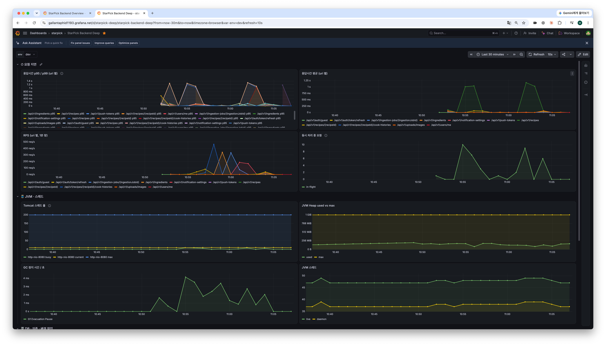
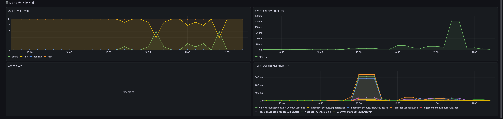

# 1회차 — 느린 API 후보 찾기 (#139)

Recipe·Cooking·Ingredient·Ingestion·Notification·Upload API에 같은 조건으로 부하를 걸어, 어떤 API가 먼저 느려지는지 **후보를 추립니다.** 원인 분석과 개선은 다음 회차에서 합니다.

## 조건

| 항목 | 값 |
|---|---|
| 대상 | dev 서버 (e2-medium 1대, 앱과 PostgreSQL이 같은 VM) |
| 부하 | k6, 구간마다 동시 사용자(VU) 10명 · 60초 · 대기 없음, 구간 사이 15초 휴지 |
| 사용자 | 게스트 10명. VU 하나에 게스트 하나를 고정합니다 |
| 데이터 | 사용자당 레시피 20개(커버 이미지·재료 5·단계 5), 요리 기록 5건, 분석 작업 1건 |
| 순위 기준 | Grafana 서버 처리 시간 **p95** (`http_server_requests_seconds`, `env="dev"`). 앱 안에서 잰 값이라 네트워크가 빠집니다 |

레시피를 20개로 둔 이유: 목록 조회 기본 페이지가 20건이라, 이미지 URL 서명이 가장 많이 일어나는 경우입니다.

## 시나리오

**A. 읽기 — API별 단독 측정** (실행 순서 A1 → A3 → A4 → A5 → A6 → A7 → A2)

| # | 요청 |
|---|---|
| A1 | `GET /recipes` (기본 page 0, size 20, LATEST) |
| A2 | `GET /recipes?searchQuery=김치` (20건) |
| A3 | `GET /recipes/{id}` (본인 레시피 중 무작위) |
| A4 | `GET /recipes/{id}/cook-histories` (기록 5건) |
| A5 | `GET /ingredients` |
| A6 | `GET /ingestion-jobs/{id}` |
| A7 | `GET /notification-settings` |

A1과 A2는 서버에서 같은 지표 시리즈로 잡혀서, 사이에 다른 구간을 두어 떼어 놓았습니다.

**B. 쓰기 — 흐름 측정.** 업로드 URL 발급 → GCS 업로드(집계 제외) → 레시피 생성 → 수정 → 요리 기록 → 삭제 → 알림 설정 저장 → 푸시 토큰 등록·해제.

**제외.** 분석 요청(`POST /ingestion-jobs`)은 응답이 바로 오고 실제 병목은 분석 Worker라서, 다음 회차에 대기 시간 기준으로 따로 잽니다. 알림 오픈 기록은 실제 발송 기록이 있어야 호출할 수 있어 뺐습니다.

## 판정

- 후보: **서버 p95 ≥ 300ms**이거나 **같은 시나리오 서버 p95 중앙값의 3배 이상**인 API. 실패율이 0%를 넘으면 무조건 후보입니다.
- 서버 p95 차이가 10% 이내인 API는 같은 순위로 봅니다(p95는 근삿값).
- 목록·상세 응답은 이미지 URL이 모두 있는지 검사합니다. 서명이 실패하면 서버가 URL을 비운 채 200을 주는데, 그러면 오히려 빨라져 순위가 뒤집히기 때문입니다.

## 실행

공통 준비(게스트 생성·시드·정리)는 [상위 README](../README.md)를 따릅니다.

```bash
cd load-test/2026-10-01-round1
mkdir -p results
export BASE_URL=https://dev-api.starpick.cloud

SCENARIOS=smoke k6 run load.js   # 스모크: check 전부 통과 확인
k6 run load.js                   # 본 측정: 약 10분 + 시드 시간
```

- setup이 사용자당 레시피를 20개까지만 채우므로 스모크와 본 측정을 이어서 돌려도 데이터는 같습니다.
- 끝나면 API별 k6 값과 **구간별 조회 시각(UTC)** 표가 출력됩니다. 서버 p95는 최근 약 2분 창의 값이라, 표의 조회 시각(구간 종료 + 20초)으로 Grafana를 조회합니다.
- VM CPU가 스모크에서 이미 포화되면 `VUS=5`로 낮춥니다.
- 구간이 끝나는 순간 k6가 진행 중인 연결을 끊어서, 서버 로그에 `Response already committed ... Broken pipe` WARN이 구간마다 몇 건 남습니다. 정상입니다.

## 결과

2026-10-06 10:54~11:04(KST) dev 측정. 앱 이미지 `59a42e8`, 측정 중 재시작 없음. 전 구간 check 100%, 실패율 0%, 이미지 URL 서명 실패 로그 0건.

### 서버 처리 시간 (Grafana, 구간 종료 + 20초 시점)

| 순위 | 구간 | API | 서버 p95 | 서버 p99 | 요청 수 | k6 p95 |
|---|---|---|---|---|---|---|
| 1 | A1 | `GET /recipes` | **1,107ms** | 1,107ms | 566 | 1,145ms |
| 1 | A2 | `GET /recipes?searchQuery=김치` | **1,040ms** | 1,107ms | 590 | 1,116ms |
| 3 | B | `DELETE /recipes/{id}` | 74ms | 87ms | 1,457 | 107ms |
| 3 | B | `POST /uploads/images` | 73ms | 82ms | 1,507 | 96ms |
| 3 | A3 | `GET /recipes/{id}` | 69ms | 82ms | 7,948 | 93ms |
| 3 | B | `POST /recipes` | 64ms | 79ms | 1,509 | 107ms |
| 7 | A5 | `GET /ingredients` | 36ms | 61ms | 21,883 | 47ms |
| 8 | B | `PATCH /recipes/{id}` | 30ms | 37ms | 1,459 | 56ms |
| 9 | B | `PUT /notification-settings` | 19ms | 24ms | 1,454 | 40ms |
| – | B | `DELETE /push-tokens` | 16ms | 21ms | 1,453 | 36ms |
| – | B | `POST /recipes/{id}/cook-histories` | 15ms | 20ms | 1,507 | 38ms |
| – | B | `PUT /push-tokens` | 15ms | 19ms | 1,453 | 36ms |
| – | A4 | `GET /recipes/{id}/cook-histories` | 10ms | 15ms | 30,067 | 29ms |
| – | A7 | `GET /notification-settings` | 9ms | 130ms | 25,308 | 35ms |
| – | A6 | `GET /ingestion-jobs/{id}` | 7ms | 12ms | 30,109 | 27ms |

p95 차이가 10% 이내면 같은 순위로 묶었습니다. 요청 수는 같은 60초 동안 처리한 건수라 처리량 차이를 그대로 보여 줍니다.

### 구간별 자원 (구간 60초 중 최대값)

| 구간 | 앱 CPU | VM 전체 CPU | Tomcat 처리 중 스레드 | DB 커넥션 사용 | 커넥션 대기 |
|---|---|---|---|---|---|
| A1 | 37% | 41% | 10 | 1 | 0 |
| A3 | 73% | 92% | 10 | 8 | 0 |
| A4 | 43% | 95% | 6 | 3 | 0 |
| A5 | 46% | 96% | 5 | 4 | 0 |
| A6 | 41% | 90% | 4 | 2 | 0 |
| A7 | 62% | 88% | 6 | 3 | 0 |
| A2 | 21% | 25% | 10 | 2 | 0 |
| B | 62% | 98% | 6 | 6 | 0 |

### 후보

| API | 판정 | 근거 |
|---|---|---|
| `GET /recipes` (목록·검색) | **후보** | 서버 p95 1.0~1.1초로 300ms 기준과 읽기 중앙값(36ms)의 3배를 모두 넘습니다. 처리량은 초당 약 9.5건으로 상세 조회(초당 약 132건)의 1/14입니다. 검색 조건을 붙여도 값이 같아서(10% 이내), 느린 부분은 조회 조건이 아니라 두 경우가 공유하는 응답 조립(이미지 URL 서명)입니다 |
| `DELETE /recipes/{id}` | 경계 | 쓰기 중앙값(24.5ms)의 3배(73.5ms)를 0.5ms 넘었습니다. p95 근삿값 오차(10%) 안에서 업로드 URL 발급(73ms)·레시피 생성(64ms)과 같은 묶음이고, 셋 다 GCS 호출(삭제·서명·존재 확인)을 포함합니다. 절대값은 300ms의 1/4입니다 |
| 나머지 | 후보 아님 | 서버 p95 36ms 이하 |

### 관찰 (원인 확정은 다음 회차)

목록 조회 요청은 서버 안에서 **무언가를 기다리고 있습니다.**

- 동시 처리 중 요청이 목록 구간에서만 10(사용자 전원)까지 찹니다. 빠른 API 구간은 0~2입니다.
- 그런데 CPU는 오히려 낮고(앱 21~37%), DB 커넥션은 1~2개만 쓰며 대기는 0입니다. Heap은 1GiB 중 약 200MiB로 평탄하고 GC 정지는 초당 4ms 이하입니다.
- CPU·DB·메모리가 아니면 남는 것은 외부 호출입니다. 목록 1건마다 커버 이미지 조회 URL을 서명하고, 서명 1번은 Google IAM 원격 호출 1번입니다(#26). 20건이면 20번이고, 1.1초를 20으로 나누면 1번에 약 55ms입니다.
- 대시보드의 "외부 호출 지연" 패널은 `RestClient` 호출만 잡아서 GCS SDK의 서명은 보이지 않습니다(No data). 그래서 지금은 정황입니다. 다음 회차에서 서명 시간을 따로 재서 확정합니다.

prod 평균(206ms)보다 크게 나온 것은 prod 사용자 대부분이 레시피 20개보다 적게 갖고 있기 때문입니다. 서명 횟수가 레시피 수와 같습니다.

**참고.**
- 가벼운 API 구간(A3~B)은 대기 없는 요청에 VM 전체 CPU가 88~98%까지 올라갔습니다. 이 구간의 절대값에는 CPU 경합이 섞여 있습니다. 다만 1위와의 차이가 15배 이상이라 순위에는 영향이 없습니다.
- `GET /notification-settings`는 p95 9ms인데 p99가 130ms입니다. 같은 시점에 커넥션 획득 최대 시간도 128ms로 찍혀, 드물게 생기는 꼬리 지연으로 보입니다. 후보 기준과는 무관해서 기록만 남깁니다.
- 10:50~10:52의 스케줄 작업 300ms 봉우리는 재배포 직후 기동 구간이라 측정 전입니다. 10:52의 목록 조회 봉우리는 측정 전 스모크입니다.

### 다음 회차

1. 서명 1번의 시간을 직접 재서 원인을 확정합니다.
2. #26의 후보 중 하나로 개선합니다. 병렬 서명(20건 기준 약 1.7초 → 150ms 예상) 또는 서명 URL 캐시입니다.
3. 새 회차 폴더에서 같은 조건으로 다시 재서 이 표와 비교합니다.

→ [2회차 결과](../2026-10-06-round2/README.md): 목록 p95 1,107ms → 138ms(−87.5%), 검색 1,040ms → 113ms(−89.1%).

### 대시보드 (StarPick Backend Deep, env=dev, 10:38~11:08 KST)

A1 목록 조회는 10:55, A2 검색은 11:03 부근입니다.



