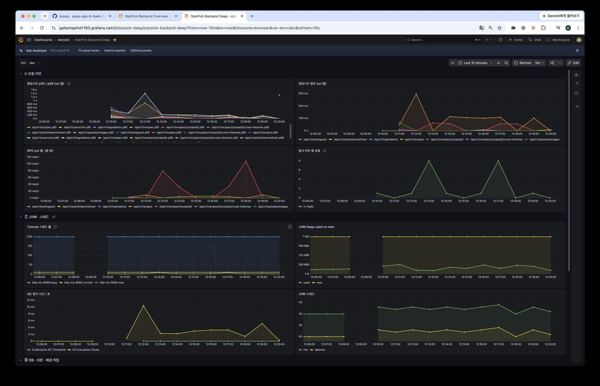
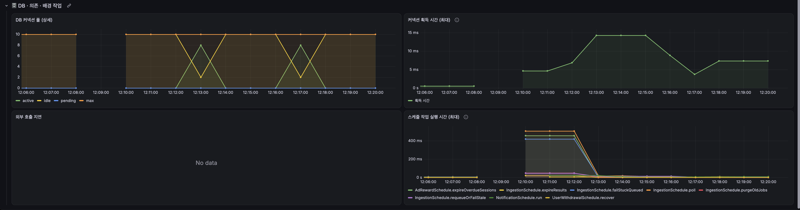

# 2회차 — 목록 조회 개선 후 재측정 (#26)

1회차에서 유일한 후보였던 `GET /recipes`(서버 p95 1.1초)를 개선한 뒤, 같은 조건에서 다시 잽니다.

## 개선 내용 (#143)

- **원인:** 목록 항목마다 커버 이미지 조회 URL을 서명하는데, 서명 1번이 IAM 원격 호출 1번(약 60ms)이고 이것을 순서대로 기다렸습니다. 20건이면 1.2초입니다.
- **해결:** 여러 장을 가상 스레드로 동시에 서명합니다. API 응답·DB는 바뀌지 않습니다.

## 조건

1회차와 같은 dev 서버, 같은 데이터(게스트 10명 × 레시피 20개, 커버 포함)입니다. 시드는 [1회차 `seed.sql`](../2026-10-01-round1/seed.sql)을 그대로 씁니다.

| 구간 | 요청 | 실행 방식 | 이유 |
|---|---|---|---|
| A1 | `GET /recipes` | **초당 9건 고정** · 60초 | 1회차 A1 처리량(초당 약 9.4건)과 같은 부하에서 비교 |
| A3 | `GET /recipes/{id}` | 동시 사용자 10명 · 60초 | **대조군.** 코드가 바뀌지 않았으므로 1회차(69ms)와 비슷해야 환경이 같다고 봅니다 |
| A2 | `GET /recipes?searchQuery=김치` | 초당 9건 고정 · 60초 | 검색도 같은 효과인지 |

**목록·검색의 요청률을 고정한 이유.** 1회차처럼 "10명이 쉬지 않고"로 걸면 빨라진 만큼 요청이 늘어 서명이 분당 10만 건을 넘습니다. IAM 서명 한도(분당 60,000건)는 프로젝트 단위라 dev·prod가 같이 쓰므로, 측정이 prod 이미지를 깨뜨릴 수 있습니다. 초당 9건이면 서명은 분당 약 10,800건으로 1회차와 같은 수준입니다.

## 판정

- 목록·검색 서버 p95가 **300ms 미만**이면 목표 달성
- 대조군(A3)이 1회차 대비 ±30%를 벗어나면 환경이 달라진 것이라 결과를 보류합니다
- 측정 중 dev·prod 모두 `조회 URL 서명에 실패` 로그 0건

## 실행

공통 준비(게스트 생성·시드·정리)는 [상위 README](../README.md)를 따릅니다. 시드 명령의 `2026-10-01-round1/seed.sql` 경로는 그대로 씁니다.

```bash
cd load-test/2026-10-06-round2
mkdir -p results
export BASE_URL=https://dev-api.starpick.cloud

SCENARIOS=smoke k6 run load.js   # 스모크: check 전부 통과 확인
k6 run load.js                   # 본 측정: 약 3분 30초 + 시드 시간
```

요청률은 `LIST_RATE`(기본 9)로 바꿀 수 있습니다.

## 결과

2026-10-06 12:15~12:19(KST) dev 측정. 앱 이미지 `e783690`(#143 머지), 측정 중 재시작 없음. 전 구간 check 100%, 실패율 0%. 측정 중 dev·prod 모두 서명 실패·ERROR 로그 0건. **목표 달성.**

### 서버 처리 시간 (Grafana, 구간 종료 + 20초 시점)

| API | 1회차 p95 | 2회차 p95 | 변화 | 2회차 p99 | 요청 수 | k6 p95 |
|---|---|---|---|---|---|---|
| `GET /recipes` (목록) | 1,107ms | **138ms** | **−87.5% (8.0배)** | 197ms | 585 | 161ms |
| `GET /recipes?searchQuery` (검색) | 1,040ms | **113ms** | **−89.1% (9.2배)** | 164ms | 585 | 148ms |
| `GET /recipes/{id}` (대조군) | 69ms | 59ms | −14.5% | 63ms | 9,374 | 76ms |

대조군이 ±30% 안이라 환경은 1회차와 같다고 봅니다.

### 구간별 자원 (구간 60초 중 최대값)

| 구간 | 앱 CPU | VM 전체 CPU | Tomcat 처리 중 스레드 | DB 커넥션 사용 | 커넥션 대기 |
|---|---|---|---|---|---|
| A1 목록 | 51% | 56% | **1** (1회차 10) | 0 | 0 |
| A3 상세 | 26% | 48% | 9 | 9 | 0 |
| A2 검색 | 47% | 52% | 1 (1회차 10) | 0 | 0 |

1회차에는 목록 구간에서 Tomcat 스레드 10개가 모두 서명 응답을 기다리며 묶여 있었습니다. 이제는 같은 요청률에서 1개면 처리됩니다.

### 첫 측정은 버렸습니다

#143 머지로 dev가 재배포된 지 **2분 만에** 첫 측정(12:11~12:14)을 시작했습니다. 목록 구간이 앱 예열(JIT 컴파일)과 겹쳐 앱 CPU 95%·VM CPU 99%·GC 정지 625ms였고, 서버 p95가 239ms(k6 p95 854ms)로 나왔습니다. 같은 코드 경로인 검색은 3분 뒤에 130ms였습니다. 예열이 끝난 뒤 같은 측정을 다시 돌렸고, 위 표는 그 값입니다. **배포 직후에는 몇 분 기다렸다가 잽니다.**

### 남은 것

- 로컬 실측에서 목록 5건까지는 약 80ms, 10건부터 약 160ms로 한 단계 오릅니다. 동시 연결이 일정 수를 넘을 때 새 연결을 맺는 비용으로 추정만 했고 목표를 만족해 다루지 않았습니다.
- 동시 서명 수에 프로세스 전체 상한이 없습니다(#143 리뷰). 서명 실패·연결 오류가 로그에 나오거나 동시 목록 요청이 늘면 공용 상한을 둡니다.

### 대시보드 (StarPick Backend Deep, env=dev, 12:06~12:20 KST)

첫 측정은 12:11~12:14(목록 봉우리), 재측정은 12:15~12:19입니다. 동시 처리 중 요청의 봉우리(8)는 대조군인 상세 조회 구간입니다.



